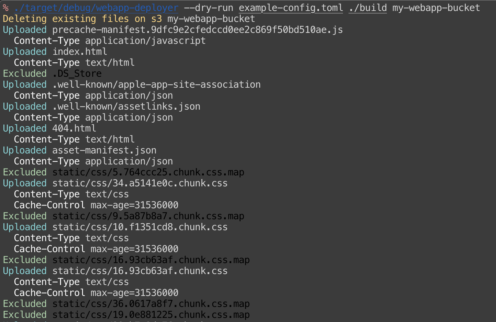

# webapp-deployer

A webapp deploy tool that upload files to s3 with meta data

`webapp-deployer` is a tool like aws cli's `s3 sync` command. It uploads files with setting metadata (e.g., `content-type`) along with a config file.

## How it works

`webapp-deployer` first delete all files in the given bucket. After that, it walks through all files under the given webapp directory. If a file matches a pattern, then it does an action. `Upload` action uploads the file. `Exclude` action skip the file. If none of the patterns matches, the file is skipped.

```
% webapp-deployer --help
webapp-deployer 1.0.0
Deploy webapp to s3

USAGE:
    webapp-deployer [FLAGS] <config-file> <app-dir> <bucket-name>

FLAGS:
    -d, --dry-run
    -h, --help       Prints help information
    -V, --version    Prints version information

ARGS:
    <config-file>
    <app-dir>
    <bucket-name>
```

## Config file

A config file is a toml format file, and that is a set of `instruction` for files.

An example instruction looks like as follows:

```toml
[[instructions]]
    pattern = "^static/css/.*\\.css$"
    action = "Upload"
    [instructions.meta]
        content_type = "text/css"
        cache_control = "max-age=31536000"
```

|property |required|description|
|-|-|-|
|pattern|Yes|file path regex pattern|
|action|Yes|Upload or Exclude|
|meta.content_type|No|content-type value|
|meta.cache-control|No|cache-control value|

## Environment variables

`webapp-deployer` takes `AWS_PROFILE` and `AWS_REGION` same as aws cli.

## Usage examples

dry run
```
% webapp-deployer --dry-run config.toml ./build my-webapp-bucket
```

```
% AWS_PROFILE=admin AWS_REGION=us-east-1 webapp-deployer config.toml ./build my-webapp-bucket
```


